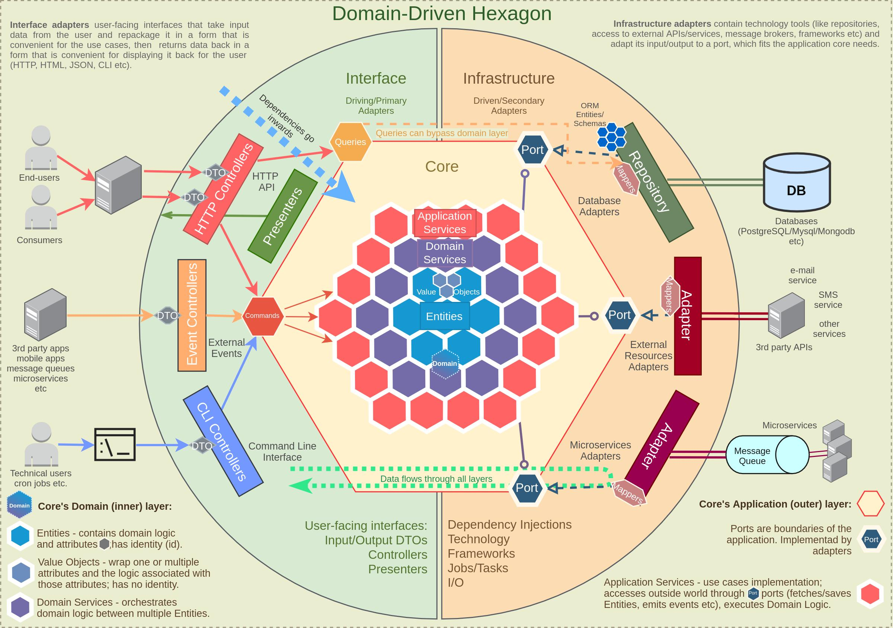
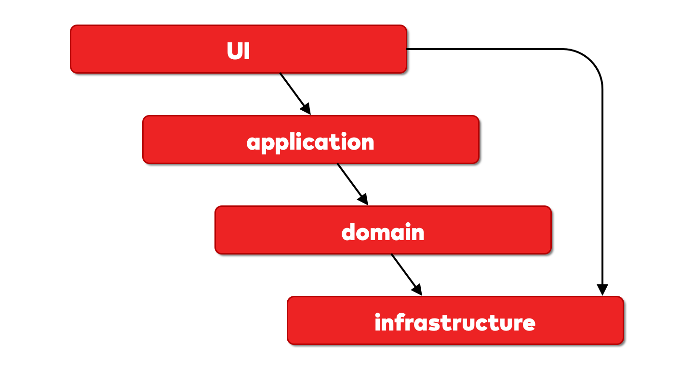

# API Template

ScaleMote's template for creating API projects.

## Motivation

Homogenisation of technology, structures & processes makes software engineering teams more effective; the trade-off is
not implementing other technologies, which is one we accept.

Even though from time to time we will need to adapt to previous code and existing ways of working, when given the
chance, greenfield projects must be created following this template.
When this template is not suitable for your needs, raise an issue and we will strive to improve it, instead of having
bespoke implementations for each project.
Having said that, each project tends to be unique and certain small & controlled deviations will be accepted.

## General architecture

This template follows a Clean Architecture style, specifically the Hexagonal architecture.



### Folder organisation

Within the `src` folder is where our application code lives,inside it, we will have a list of modules. A module is a
business-driven way of slicing a project.
You can either split a project by technical responsibility (controllers, repositories, services, entities) or you can do
it by it's business function (books, authors, publishers, etc.).
We choose the latter. All code pertaining a certain business concept should stay together.

| Folder         | Description                                                                                                                                                                                                                                                                                                                                                                     |
|----------------|---------------------------------------------------------------------------------------------------------------------------------------------------------------------------------------------------------------------------------------------------------------------------------------------------------------------------------------------------------------------------------|
| Interface      | The interface folder contains files related to interfacing with a client. Here we can add HTTP controllers or CLI controllers.                                                                                                                                                                                                                                                  |
| Application    | The application folder contains application logic, for instance DTOs that the Interface layers use, mappers to translate DTOs into entities or vice-versa, a repository folder where we will store the INTERFACE of this repository (the concrete implementation lives in the infrastructure layer) and a service or use-case folder where we connect infrastructure and domain |
| Domain         | The domain folder contains the enterprise rules, and it does not depend on any other layer. This layer can be TDD'd and unit tested independently of any other layer.                                                                                                                                                                                                           |
| Infrastructure | The infrastructure folder contains the access to the database, APIs and other 3rd party services or devices.                                                                                                                                                                                                                                                                    |

### General flow of information & layer interdependencies



Please note in this image, UI is the Interface layer.

The interface layer (the controller) can access the infrastructure directly. This is to avoid creating bloated code,
let's see an example:

```javascript
// A controller accessing a repository directly

function getAllUsers (page) {
  this.userService.getPaginatedResponseDto(this.repository.getAllUsers(page))
}
```

```javascript
// A controller accessing a repository through a service

function getAllUsers (page) {
  this.userService.getAllUsers(page);
}

// Service
function getAllUsers (page) {
  this.getPaginatedResponseDto(this.repository.getAllUsers(page))
}
```

If we have to create this structure for every controller method, our services will quickly become too big and they will
essentially replicate the same functionality that the controller should be able to provide from the get-go.

Service methods are useful when they actually contain some business logic.

## Missing docs:

run on repl
npm run start -- --entryFile repl see  https://docs.nestjs.com/recipes/repl#usage

uses typeorm (https://docs.nestjs.com/techniques/database)
hot reloading (https://docs.nestjs.com/recipes/hot-reload)
openapi https://docs.nestjs.com/openapi/introduction hosted on / not exposed in prod (can enable if intended to be a
public api)
versioning via URI https://docs.nestjs.com/techniques/versioning
logging https://docs.nestjs.com/techniques/logger
configuration https://docs.nestjs.com/techniques/configuration (.env usage)

separate entity from schema https://docs.nestjs.com/techniques/database#separating-entity-definition explain why

use transaction in services if required https://docs.nestjs.com/techniques/database#typeorm-transactions

testing https://docs.nestjs.com/fundamentals/testing#end-to-end-testing
testing with supertest and jest
supertest = everything (controllers and fake db, use fixtures, etc.)
jest = domain, 100% unit tested
https://www.valentinog.com/blog/jest-coverage/

cross-env

npm run migration:generate -n PostRefactoring

husky
add pre-commit (lint staged and tests)

configure
eslint
prettier w/ auto sort import

path aliases

```javascript
// Original:
import CatModule from '../../cat/cat.module.ts'
// Alias Path:
import CatModule from '@/cat/cat.module.ts'
```

remember to keep jest and tsconfig in sync

https://javascript.plainenglish.io/a-simple-way-to-use-path-aliases-in-nestjs-ab0db1be1545

serialization
https://docs.nestjs.com/techniques/serialization
